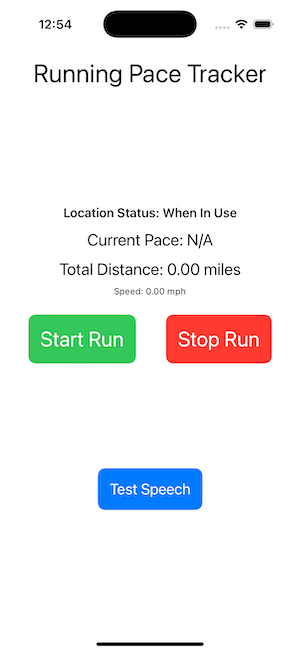

# Running Pace Tracker

A simple iOS application built with **SwiftUI** and **Core Location** to track your running pace, distance, and provide real-time voice feedback. This project serves as an introductory dive into iOS app development.

## 📸 Screenshots

### Main Screen

_A simple MVP interface displaying current pace and distance._

## ✨ Features

*   **Real-time Pace Tracking:** Displays your current pace in minutes per mile.
*   **Distance Calculation:** Shows your total distance covered.
*   **Speed Display:** Shows your current speed in miles per hour.
*   **Voice Announcements:** Provides spoken updates on your pace and total distance every 0.1 miles.
    * **Audio Ducking:** Temporarily lowers the volume of other background audio (like music) during voice announcements.
    * **Silent Mode Compatibility:** Voice feedback plays even when the iPhone's silent switch is on.
*   **Location Authorization Handling:** Handles user permissions for location services.
*   **Background Tracking:** Continues tracking and providing voice feedback even when the app is in the background or the screen is off (requires explicit user permission).

## 🛠️ Technologies Used

*   **Swift:** The primary programming language for iOS development.
*   **SwiftUI:** Apple's declarative UI framework for building app interfaces.
*   **Core Location:** Framework for managing location services, including GPS.
*   **AVFoundation:** Used specifically for `AVSpeechSynthesizer` to provide voice feedback.

## 🚀 Getting Started

Follow these steps to set up and run the project on your local machine.

### Prerequisites

*   Xcode (version 13.0 or later recommended)
*   A Mac running macOS
*   An iPhone or iPad for physical device testing (optional, but recommended for location apps)

### Installation

1.  **Clone the repository:**
    
        git clone https://github.com/PaulGLujan/RunningPaceTracker.git
        cd RunningPaceTracker
    
2.  **Open in Xcode:** Double-click `RunningPaceTracker.xcodeproj` to open the project in Xcode.
    
3.  **Configure Signing & Capabilities:**
    
    *   In the Xcode Project Navigator, select your project.
    *   Select the `RunningPaceTracker` target.
    *   Go to the **"Signing & Capabilities"** tab.
    *   Under "Signing," ensure "Automatically manage signing" is checked.
    *   Select your **Personal Team** under the "Team" dropdown. (If you haven't added an Apple ID to Xcode, go to `Xcode > Settings... > Accounts` to add it.)
    *   Verify that **"Background Modes"** is added and both **"Location updates"** and **"Audio, AirPlay, and Picture in Picture"** are checked.
4.  **Add Location Privacy Description:**
    
    *   In the "Info" tab of your target settings, ensure you have the key `Privacy - Location When In Use Usage Description` with a string value explaining why your app needs location access (e.g., "This app needs your location to track your run distance and pace.").

### Running the App

1.  **Select a Simulator or Device:**
    
    *   From the scheme dropdown in Xcode's toolbar, choose an iOS Simulator (e.g., iPhone 15 Pro) or your connected physical iPhone.
    *   If using a **physical device with iOS 16+**, ensure **Developer Mode** is enabled (`Settings > Privacy & Security > Developer Mode`). You might also need to "Trust" your developer app in `Settings > General > VPN & Device Management` the first time you run it.
2.  **Run the App:**
    
    *   Click the **"Run" button** (the play icon) in Xcode's toolbar.
3.  **Grant Permissions:**
    
    *   When the app launches, you'll be prompted to allow location access. Choose **"Allow While Using App"**.
4.  **Simulate Movement (Simulator Only):**
    
    *   If using a simulator, once the app is running, go to your Mac's menu bar: **`Debug > Location`** and select **"City Run"** or **"Freeway Drive"** to simulate movement.
    * To test audio with silent mode on the simulator, ensure device bezels are visible (`Window > Show Device Bezels`), then click the physical Ring/Silent switch on the simulated device's bezel.
5.  **Start Tracking:**
    
    *   Tap the **"Start Run"** button in the app to begin tracking.
    *   You should see your pace and distance update, and hear voice announcements, even with background music playing.

## 🗺️ Future Enhancements (Ideas)

*   **Run History:** Save and review past runs, including total distance, time, and average pace.
*   **Pause/Resume Functionality:** Allow users to pause and resume a run.
*   **Customizable Voice Intervals:** Let users set their preferred distance interval for voice updates (e.g., every 0.25 miles, every mile).
*   **Map Integration:** Display the run route on a map using MapKit.
*   **Workout Goals:** Set targets for distance or time.
*   **Unit Preferences:** Allow users to switch between miles and kilometers.

## 🤝 Contributing

Feel free to fork this repository, make improvements, and submit pull requests. Any contributions are welcome!
